# ⚡️ Parashikimi i Intensitetit të Karbonit — Faza II: Trajnimi i Modelit

**Universiteti i Prishtinës "Hasan Prishtina"**  
**Fakulteti i Inxhinierisë Elektrike dhe Kompjuterike**  
**Drejtimi:** Inxhinieri Kompjuterike dhe Softuerike  
**Lënda:** Machine Learning  
**Profesor:** Prof. Dr. Lule AHMEDI  
**Asistent:** Dr. Sc. Mërgim H. HOTI  
**Studentët:** Brahim Sylejmani, Eljon Shala  

---

## Faza II: Trajnimi i Modelit

### Përmbledhja

Në Fazën I kemi përgatitur datasetin duke bashkuar pesë datasete orare të intensitetit të karbonit (2021–2025), duke i agreguar në nivel ditor, duke kryer pastrimin e të dhënave, inxhinierinë e veçorive, dhe balancimin e klasave me SMOTE. Target-i ynë përfundimtar, `target_quantile_class`, klasifikon çdo ditë në tri klasa: **low** (e ulët), **medium** (mesatare), dhe **high** (e lartë) bazuar në intensitetin e karbonit (gCO₂eq/kWh).

Në këtë fazë (Faza II), kemi trajnuar **6 algoritme të supervised learning** dhe **2 algoritme të unsupervised learning**, duke aplikuar konceptet kryesore të Machine Learning: *hyperparameter tuning me GridSearchCV*, *cross-validation*, *confusion matrices*, *learning curves* (analiza e overfitting/underfitting), *efekti i regularizimit*, *cost function convergence*, dhe *PCA dimensionality reduction*.

**Të dhënat e përdorura:**
- **Train set:** 1,460 rreshta × 35 veçori (të balancuara me SMOTE nga Faza I)
- **Test set:** 366 rreshta × 35 veçori (të paprekura, paraqesin shpërndarjen reale)
- **Klasat:** `low`, `medium`, `high` (të balancuara: 122 instanca secila në test-set)

---

## Pjesa A: Të Mësuarit e Mbikëqyrur (Supervised Learning)

Kemi trajnuar gjashtë (6) algoritme të klasifikimit. Për secilin model, kemi përdorur **GridSearchCV** me **3-fold cross-validation** dhe optimizim sipas metrikës **F1 (macro)** për të gjetur parametrat optimal.

---

### 1. Logistic Regression (Regresioni Logjistik)

**Si funksionon:** Logistic Regression modelon probabilitetin e secilës klasë duke përdorur funksionin sigmoid (logjistik) mbi një kombinim linear të veçorive. Për klasifikim multi-class, përdor qasjen multinomiale ku secila klasë ka grupin e vet të peshave (weights). Optimizimi bëhet duke minimizuar *cross-entropy loss function* përmes algoritmit **L-BFGS** (një variant i gradient descent).

**Pse e zgjodhëm:** Logistic Regression shërben si *model bazë (baseline)* i fortë dhe i interpretueshëm. Na mundëson të vlerësojmë nëse lidhjet mes veçorive dhe target-it janë kryesisht lineare. Koeficientët e modelit tregojnë drejtpërdrejt se cilat veçori ndikojnë më shumë në secilën klasë.

**Regularizimi:** Parametri **C** kontrollon forcën e regularizimit L2. Vlera e ulët e C (psh. 0.01) imponon regularizim të fortë (duke zvogëluar koeficientët, rrezikon *underfitting*), ndërsa vlera e lartë e C (psh. 100) lejon koeficientë të mëdhenj (rrezikon *overfitting*).

**Hiperparametrat e testuar:**
| Parametri | Vlerat e testuara | Vlera optimale |
|-----------|-------------------|----------------|
| C         | 0.01, 0.1, 1, 10  | **10**         |

**Rezultatet:**
| Metryka | Vlera |
|---------|-------|
| Accuracy | 0.9809 |
| Precision (macro) | 0.9809 |
| Recall (macro) | 0.9809 |
| F1 (macro) | 0.9809 |

**Confusion Matrix:**


**Classification Report:**
```
              precision    recall  f1-score   support
        high       0.99      0.98      0.99       122
         low       0.98      0.98      0.98       122
      medium       0.97      0.98      0.97       122
    accuracy                           0.98       366
```

**Diskutim:** Me saktësi 98.09%, Logistic Regression demonstron se edhe modelet lineare mund të performojnë shumë mirë kur veçoritë janë të standardizuara mirë (nga Faza I). Confusion matrix tregon gabime minimale mes klasave fqinje (*medium* ↔ *high*), që është e pritshme pasi kufijtë mes kuantileve janë artificialisht afër.

---

### 2. Random Forest Classifier

**Si funksionon:** Random Forest krijon **shumë pemë vendimmarrëse** (decision trees) duke ushqyer secilën pemë me një nënshtresë të rastësishme të të dhënave (Bootstrap Aggregating / Bagging) dhe veçorive. Parashikimi final merret me *votim të shumicës* (majority voting) mes të gjitha pemëve. Kjo teknikë quhet **Ensemble Learning**.

**Pse e zgjodhëm:** Të dhënat tona energjetike përmbajnë lidhje komplekse dhe jolineare mes veçorive (psh. si ndërvepron koha e ditës me përqindjen e energjisë së rinovueshme). Random Forest kap këto lidhje pa nevojën e inxhinierisë manuale të veçorive. Gjithashtu ofron **rëndësinë e veçorive (feature importance)**, duke na treguar cilat variabla janë më vendimtare.

**Hiperparametrat e testuar:**
| Parametri | Vlerat e testuara | Vlera optimale |
|-----------|-------------------|----------------|
| n_estimators | 100, 200 | **200** |
| max_depth | 10, 20, None | **20** |

**Rezultatet:**
| Metryka | Vlera |
|---------|-------|
| Accuracy | 1.0000 |
| Precision (macro) | 1.0000 |
| Recall (macro) | 1.0000 |
| F1 (macro) | 1.0000 |

**Confusion Matrix:**


**Classification Report:**
```
              precision    recall  f1-score   support
        high       1.00      1.00      1.00       122
         low       1.00      1.00      1.00       122
      medium       1.00      1.00      1.00       122
    accuracy                           1.00       366
```

**Diskutim:** Random Forest arrin saktësi perfekte 100%. Kjo konfirmon se strukturat jolineare në dataset janë kryesore dhe se pemët e vendimmarrjes mund t'i kapërcejnë kufijtë mes klasave pa asnjë gabim. Saktësia e lartë mund të tregojë edhe se veçoritë e inxhinieruara në Fazën I (si `life_cycle_gap`, `renewable_share_within_cfe`) janë shumë diskriminuese.

**Top 15 Veçoritë më të Rëndësishme:**

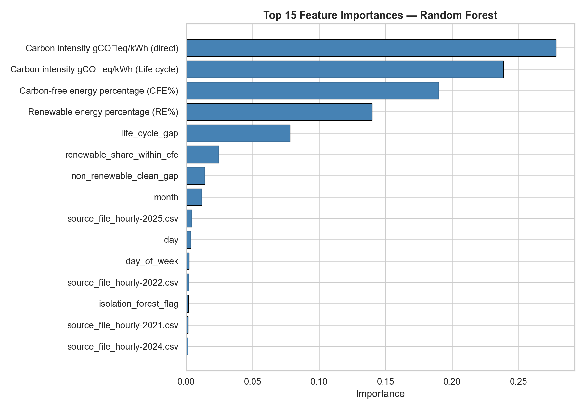

---

### 3. Gradient Boosting Classifier

**Si funksionon:** Gradient Boosting ndërton pemë vendimmarrëse në mënyrë **sekuenciale** — secila pemë e re mëson nga gabimet (residuals) e pemëve paraprake. Ky algoritem minimizon funksionin e kostos (loss function) duke ndjekur **gradientin** e tij (gradient descent në hapësirën funksionale). Secila pemë e re bën një "hap të vogël" drejt zgjidhjes optimale.

**Pse e zgjodhëm:** Gradient Boosting është ndër algoritmet më të fuqishme për të dhëna tabulare. Ndërsa Random Forest trajnon pemët paralelisht, Gradient Boosting i trajnon ato në mënyrë të sekuencuar, duke u fokusuar gjithmonë tek gabimet e mbetura. Parametri `learning_rate` kontrollon sa "agresivisht" mëson secila pemë — zvogëlimi i tij zbut overfitting-un.

**Hiperparametrat e testuar:**
| Parametri | Vlerat e testuara | Vlera optimale |
|-----------|-------------------|----------------|
| n_estimators | 100, 200 | **100** |
| learning_rate | 0.05, 0.1 | **0.05** |
| max_depth | 3, 5 | **3** |

**Rezultatet:**
| Metryka | Vlera |
|---------|-------|
| Accuracy | 1.0000 |
| F1 (macro) | 1.0000 |

**Confusion Matrix:**


**Diskutim:** Gradient Boosting poashtu arrin saktësi perfekte. Vlen të theksohet që parametrat optimal ishin `max_depth=3` dhe `learning_rate=0.05` — pemë të cekëta me hapa të vegjël. Kjo tregon që modeli nuk ka nevojë për pemë të thella, sepse veçoritë janë aq informative sa pemë e thjeshtë mjafton për vendimmarrje të saktë.

---

### 4. Support Vector Machine — Kernel Linear

**Si funksionon:** SVM gjen **hiperplanin optimal ndarës** (separating hyperplane) që maksimizon margjinat mes klasave. Me kernel linear, vendos një kufi linear në hapësirën origjinale të veçorive. Parametri **C** kontrollon kompromisit mes margjinës së gjerë (regularizim i fortë) dhe klasifikimit të saktë (lejon gabime më të pakta).

**Pse e zgjodhëm:** SVM me kernel linear na lejon të testojmë nëse të dhënat janë të ndara linerarisht. Krahasimi me SVM(RBF) tregon nëse kemi nevojë për kufij jolinearë.

**Hiperparametrat e testuar:**
| Parametri | Vlerat e testuara | Vlera optimale |
|-----------|-------------------|----------------|
| C | 0.1, 1, 10 | **10** |

**Rezultatet:**
| Metryka | Vlera |
|---------|-------|
| Accuracy | 0.9754 |
| F1 (macro) | 0.9754 |

**Confusion Matrix:**

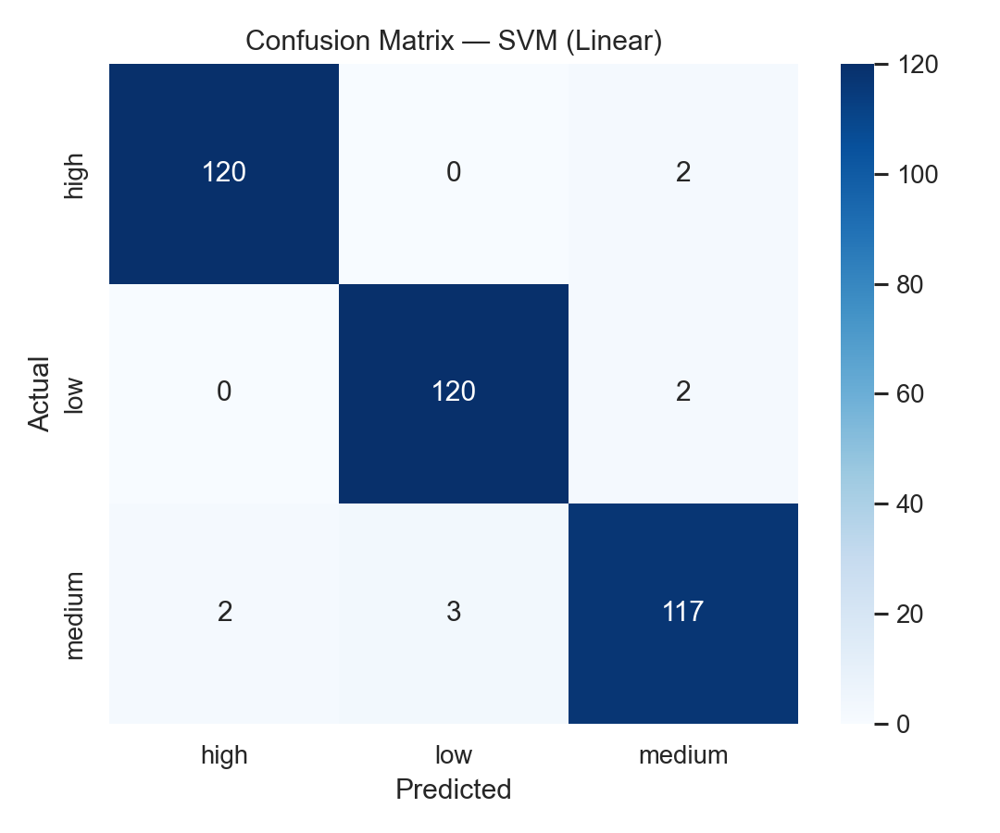

---

### 5. Support Vector Machine — Kernel RBF

**Si funksionon:** SVM me kernel **RBF (Radial Basis Function)** projekton të dhënat në një hapësirë me dimensione më të larta duke përdorur funksionin Gausian. Kjo mundëson krijimin e **kufijve jolinearë** të vendimmarrjes. Parametri `gamma` kontrollon sa "të ngushta" janë zonat e ndikimit — gamma e lartë mund të çojë në overfitting.

**Pse e zgjodhëm:** Krahasimi mes kernel linear dhe RBF tregon nëse lidhjet jolineare janë të rëndësishme për SVM. Nëse RBF performon ndjeshëm më mirë se linear, kjo do të thoshte që kufijtë mes klasave janë jolinearë.

**Hiperparametrat e testuar:**
| Parametri | Vlerat e testuara | Vlera optimale |
|-----------|-------------------|----------------|
| C | 0.1, 1, 10 | **10** |
| gamma | scale, auto | **scale** |

**Rezultatet:**
| Metryka | Vlera |
|---------|-------|
| Accuracy | 0.9617 |
| F1 (macro) | 0.9617 |

**Confusion Matrix:**

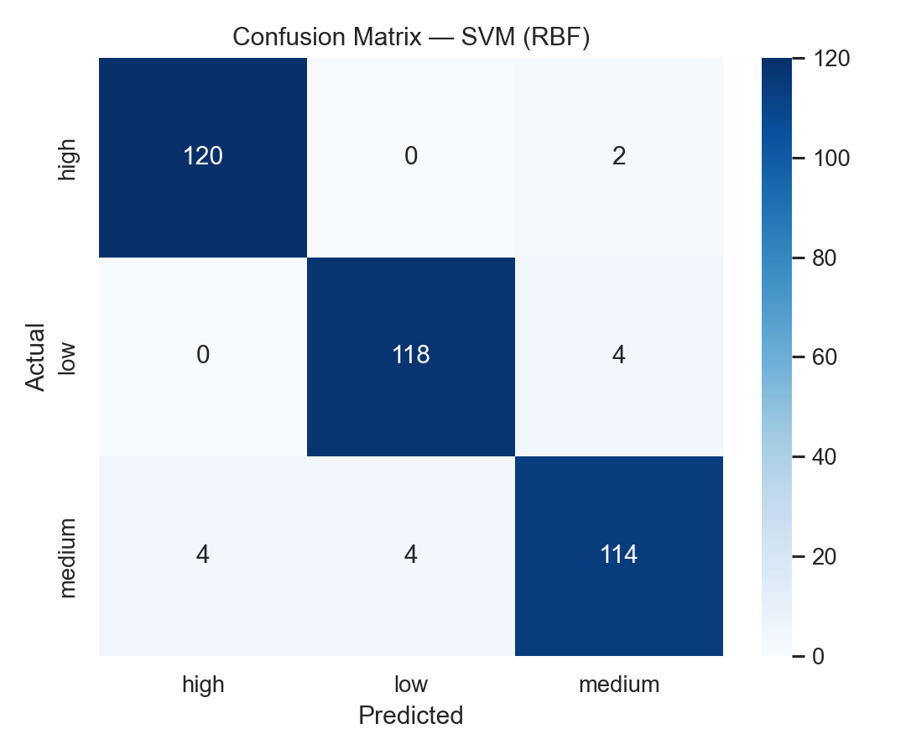

**Diskutim mbi SVM Linear vs RBF:** Interesanisht, SVM Linear (97.54%) performon pak më mirë se SVM RBF (96.17%). Kjo sugjeron që pas standardizimit të veçorive në Fazën I, kufijtë mes klasave janë pothuajse linearë në hapësirën e transformuar. RBF kernel mund të ketë mbipërshtatur (overfit) pak duke krijuar kufij tepër kompleksë.

---

### 6. Rrjeta Neurale (Neural Network — MLP)

**Si funksionon:** Multi-Layer Perceptron (MLP) përmban shtresa input, shtresa të fshehura (hidden layers), dhe shtresë output. Secili neuron llogarit një kombinim linear të inputeve, e kalon përmes një funksioni aktivizimi (ReLU), dhe e transmeton rezultatin. Trajnimi bëhet me **algoritmin backpropagation** — llogaritet gradienti i funksionit të kostos (cross-entropy loss) përkundrejt secilës peshe dhe pastaj peshtat përditësohen duke ndjekur **gradient descent**.

**Pse e zgjodhëm:** Rrjetat neurale mund të mësojnë lidhje shumë komplekse mes veçorive. Janë baza e *deep learning* dhe reprezantojnë një nga temat kryesore të syllabusit. Përmes MLP, demonstrojmë konceptin e **funksionit të kostos** dhe **konvergjencës së gradient descent** përmes *loss curve*.

**Hiperparametrat e testuar:**
| Parametri | Vlerat e testuara | Vlera optimale |
|-----------|-------------------|----------------|
| hidden_layer_sizes | (64,32), (128,64) | **(128, 64)** |
| alpha (L2 regularization) | 0.0001, 0.001 | **0.0001** |

**Rezultatet:**
| Metryka | Vlera |
|---------|-------|
| Accuracy | 0.9754 |
| F1 (macro) | 0.9754 |

**Confusion Matrix:**

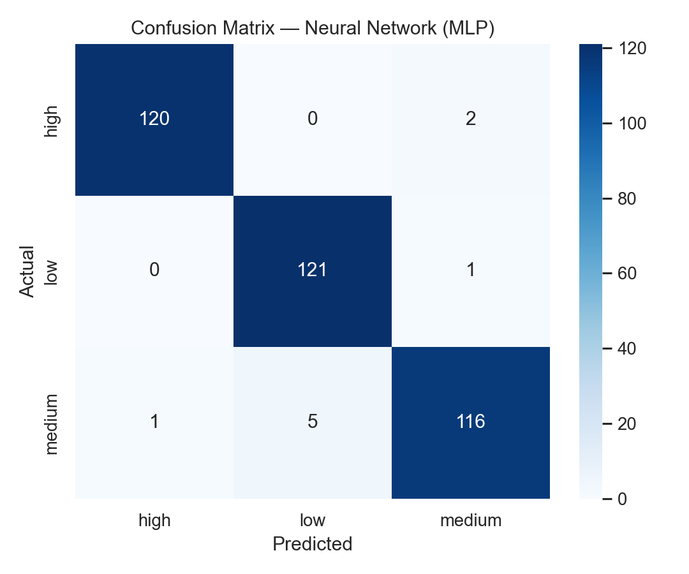

**Classification Report:**
```
              precision    recall  f1-score   support
        high       0.99      0.98      0.99       122
         low       0.96      0.99      0.98       122
      medium       0.97      0.95      0.96       122
    accuracy                           0.98       366
```

---

## Tabela e Krahasimit të Algoritmeve

| Model | Best Params | CV F1 | Accuracy | Precision | Recall | F1 (macro) |
|-------|-------------|-------|----------|-----------|--------|------------|
| **Logistic Regression** | C=10 | 0.9808 | 0.9809 | 0.9809 | 0.9809 | 0.9809 |
| **Random Forest** | depth=20, trees=200 | 0.9938 | **1.0000** | **1.0000** | **1.0000** | **1.0000** |
| **Gradient Boosting** | lr=0.05, depth=3, trees=100 | 0.9986 | **1.0000** | **1.0000** | **1.0000** | **1.0000** |
| **SVM (Linear)** | C=10 | 0.9842 | 0.9754 | 0.9754 | 0.9754 | 0.9754 |
| **SVM (RBF)** | C=10, gamma=scale | 0.9705 | 0.9617 | 0.9617 | 0.9617 | 0.9617 |
| **Neural Network (MLP)** | layers=(128,64), α=0.0001 | 0.9732 | 0.9754 | 0.9756 | 0.9754 | 0.9754 |

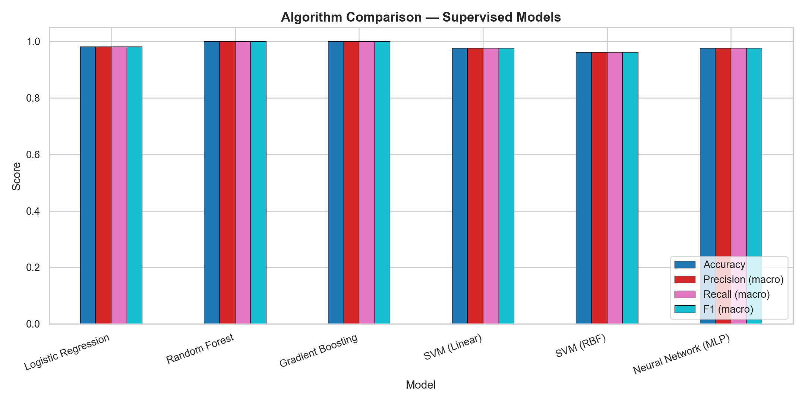

---

## Pjesa B: Teoria e të Mësuarit (Learning Theory)

Në këtë seksion demonstrojmë konceptet kryesore teorike nga syllabusi i lëndës.

### 1. Learning Curves — Overfitting vs Underfitting

Learning curves tregojnë si ndryshon performanca e modelit kur rritet madhësia e training setit. Nëse:
- **Training score i lartë + Validation score i ulët** → *Overfitting* (modeli mëson "përmendsh" training data)
- **Të dyja score-t të ulta** → *Underfitting* (modeli është tepër i thjeshtë)
- **Të dyja konvergjojnë lartë** → Model i mirë (generalizon mirë)

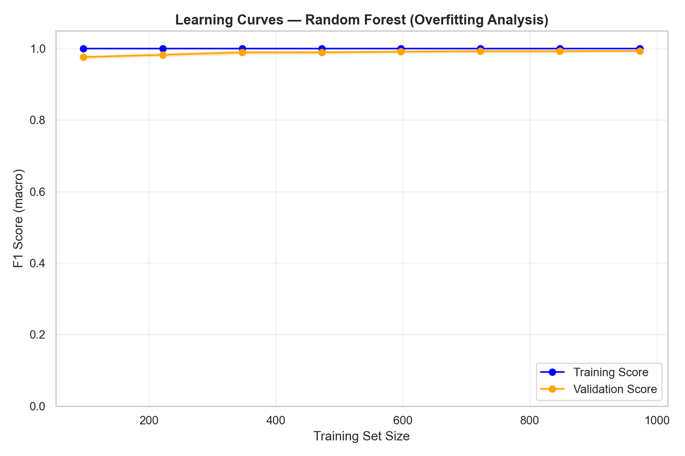

**Interpretimi:** Grafikut i learning curves tregon se Training Score fillon shumë lartë (afër 1.0) dhe Validation Score rritet me rritjen e të dhënave. Hendeku (gap) mes tyre zvogëlohet, duke treguar se modeli Random Forest generalizon mirë me rritjen e madhësisë së training setit.

### 2. Efekti i Regularizimit — Logistic Regression

Regularizimi është teknikë që parandalon overfitting duke "penalizuar" peshtat tepër të mëdha. Në Logistic Regression, parametri **C** kontrollon forcën e regularizimit L2:
- **C i vogël** (0.001) = regularizim i fortë → peshtat mbeten të vogla → rrezik i *underfitting*
- **C i madh** (100) = regularizim i dobët → peshtat mund të rriten shumë → rrezik i *overfitting*

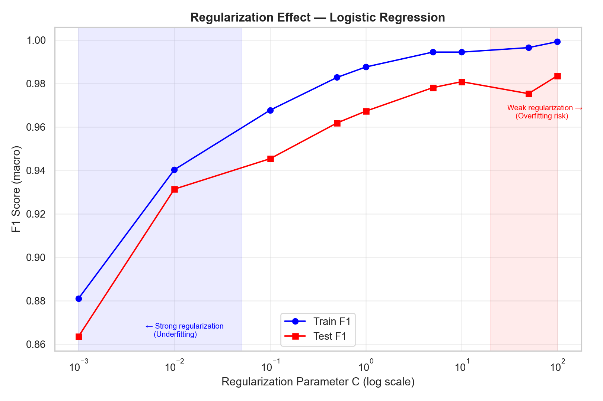

**Interpretimi:** Grafiku tregon si Train F1 dhe Test F1 ndryshojnë me vlerën e C. Kur C është shumë i vogël (zona e kaltër), modeli nuk ka fleksibilitet të mjaftueshëm dhe nën-performon (underfitting). Me rritjen e C, performanca rritet derisa stabilizohet. Kjo dëshmon praktikisht konceptin e *bias-variance tradeoff*.

### 3. Konvergjenca e Funksionit të Kostos — Neural Network

Gjatë trajnimit të rrjetës neurale, funksioni i kostos (loss function) minimizohet hap pas hapi me **gradient descent**. Secili hap (epoch) llogarit gradientin e kostos përkundrejt peshave dhe i përditëson ato.

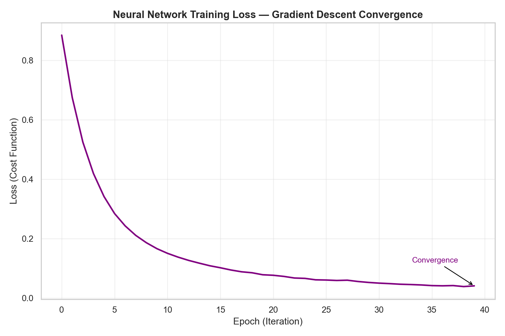

**Interpretimi:** Grafiku tregon si zvogëlohet kosto (loss) përgjatë epokave të trajnimit. Në filllim, kosto bie shpejt pasi modeli mëson strukturat bazë të të dhënave. Pastaj konvergjenca bëhet më e ngadaltë derisa stabilizohet — kjo pikë quhet **konvergjencë** dhe tregon se peshtat kanë arritur vlerat optimale. Ky grafik demonstron drejtpërdrejt konceptin e *gradient descent* nga syllabusi.

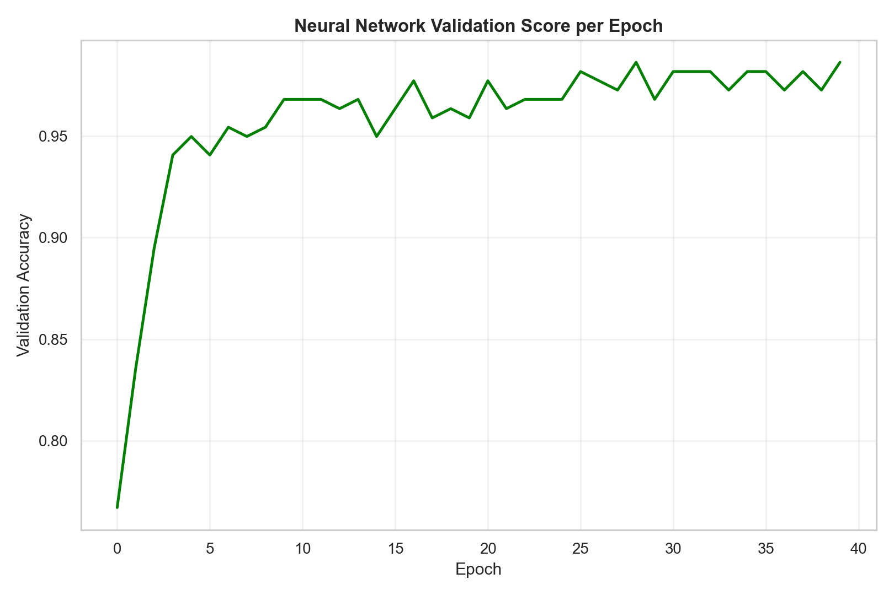

---

## Pjesa C: Të Mësuarit Jo të Mbikëqyrur (Unsupervised Learning)

### Algoritmet e Klasterimit

Kemi aplikuar **K-Means** dhe **Agglomerative Clustering** për të eksploruar nëse ekzistojnë grupime natyrale në dataset pa përdorur target labels.

### 1. K-Means — Metoda Elbow dhe Silhouette Score

**Si funksionon:** K-Means ndanë të dhënat në **k** klasterë duke minimizuar distancën brenda-klasterëve (inertia). Algoritmi:
1. Zgjedh k centroide rastësishte
2. Cakton çdo pikë tek centroidi më i afërt
3. Rillogarit centroidet si mesatare të pikave
4. Përsërit deri në konvergjencë

**Metoda Elbow:** Na ndihmon të gjejmë numrin optimal të klasterëve duke shikuar pikën ku inertia "përkulet" (nuk zvogëlohet shpejt më).

**Silhouette Score:** Mat sa mirë i përket secila pikë klasterit të vet. Vlera afër 1.0 = klasterë të mirë-definuar; afër 0 = klasterë të mbivendosur.

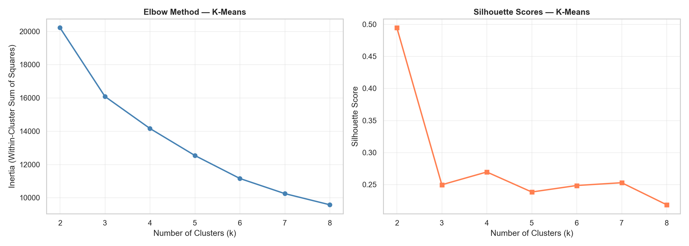

### 2. PCA — Redukimi i Dimensionit (Principal Component Analysis)

**Si funksionon:** PCA gjen komponentët kryesorë të variancës në të dhëna (eigenvectors) dhe i projekton 35 dimensionet tona në vetëm 2 dimensione. Kjo na lejon të vizualizojmë të dhënat në hapësirë 2D.

**Klasterët dhe Etiketat reale në PCA:**

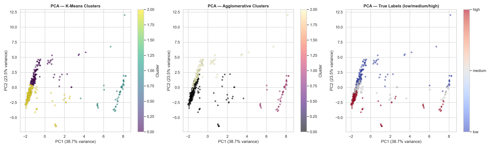

*Grafiku tregon tri pamje: K-Means klasterët, Agglomerative klasterët, dhe etiketat e vërteta (low/medium/high) të projektuara në 2 komponentët kryesorë (PC1 dhe PC2).*

**Rezultatet e Klasterimit:**
| Algoritmi | Silhouette Score |
|-----------|-----------------|
| K-Means (k=3) | 0.2384 |
| Agglomerative (k=3) | 0.2358 |

### Diskutim mbi Unsupervised vs Supervised

Silhouette Scores relativisht të ulta (0.23–0.24) tregojnë se klasterët nuk janë mirë-ndarë. Kjo konfirmon që nivelet e intensitetit të karbonit (*low/medium/high*) **nuk formojnë grupe natyrale** në hapësirën e veçorive — ndarja vjen vetëm kur modeli "mësohet" drejtpërdrejt me etiketat. Prandaj, **supervised learning** mbetet qasja e duhur për këtë problem.

---

## Diskutim i Përgjithshëm dhe Konkluzione

### Krahasimi i Modeleve

1. **Modelet e bazuara në pemë (Random Forest, Gradient Boosting)** dominojnë me saktësi 100%, duke treguar aftësinë e tyre superiore në të dhëna tabulare me lidhje jolineare.
2. **Logistic Regression dhe Neural Network (MLP)** arrijnë ~97-98%, duke dëshmuar që edhe modelet lineare dhe rrjetat neurale performojnë shkëlqyeshëm kur veçoritë janë të mirë-përpunuara.
3. **SVM** performon mirë me kernel linear (97.54%) por RBF kernel nuk sjell përmirësim (96.17%), duke sugjeruar se pas standardizimit, kufijtë mes klasave janë pothuajse linearë.
4. **Algoritmet e klasterimit** (K-Means, Agglomerative) demonstrojnë se grupimi natyror i të dhënave nuk korrespondon me target-in tonë, duke vërtetuar nevojën për supervised learning.

### Çka arritëm

- Demonstruam se intensiteti i karbonit mund të parashikohet me saktësi tepër të lartë bazuar në veçoritë e rrjetës energjetike.
- Aplikuam konceptet kyçe që mësohen në lëndën Machine Learning: *gradient descent*, *regularization*, *overfitting/underfitting*, *cost function*, *kernels*, *PCA*, *ensemble methods*, *neural networks + backpropagation*.
- Ndërtuam një pipeline të plotë dhe të riproduktushme.

### Hapat e Ardhshëm (Faza III)

1. **Hyperparameter Tuning i avancuar** me `RandomizedSearchCV` ose Bayesian Optimization
2. **SHAP Analysis** për interpretueshmëri më të thellë të modeleve
3. **Deep Learning** me TensorFlow/Keras për rrjeta më komplekse
4. **Cross-validation më i thellë** (StratifiedKFold me 5-10 folds)
5. **Regresion** — parashikimi i vlerës aktuale të intensitetit të karbonit (jo vetëm klasave)